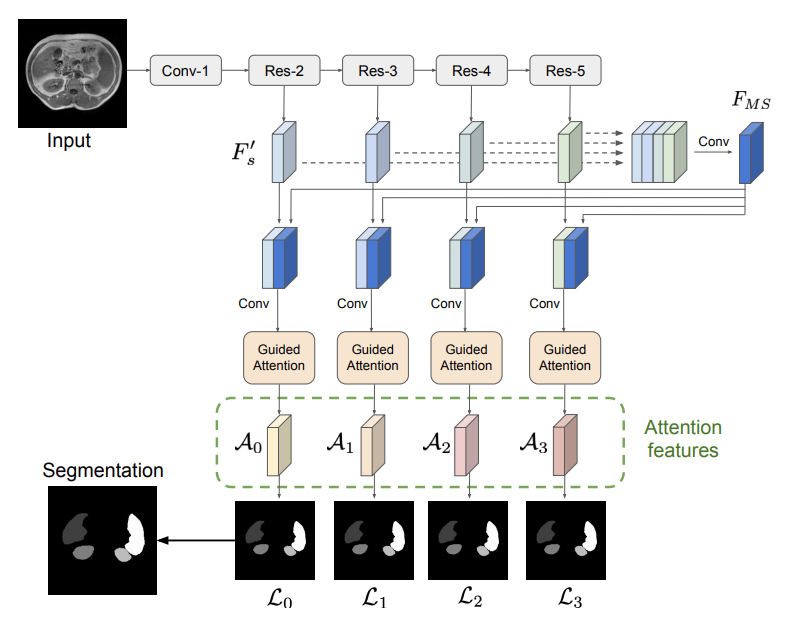
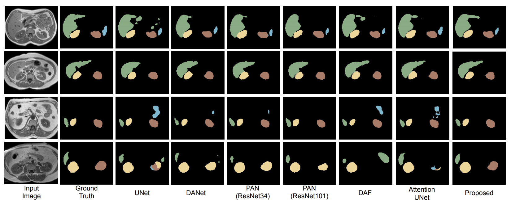

# Medical Image Segmentation with Guided Attention
This repository contains the code of our paper:<br>
"['Multi-scale guided attention for medical image segmentation'"](https://arxiv.org/pdf/1906.02849.pdf).


## Abstract

Even though convolutional neural networks (CNNs) are driving progress in medical image segmentation, standard models still have some drawbacks. First, the use of multi-scale approaches, i.e., encoder-decoder architectures, leads to a redundant use of information, where similar low-level features are extracted multiple times at multiple scales. Second, long-range feature dependencies are not efficiently modeled, resulting in nonoptimal discriminative feature representations associated with each semantic class. In this paper we attempt to overcome these limitations with the proposed architecture, by capturing richer
contextual dependencies based on the use of guided self-attention
mechanisms. This approach is able to integrate local features with their corresponding global dependencies, as well as highlight interdependent channel maps in an adaptive manner. Further, the additional loss between different modules guides the attention mechanisms to neglect irrelevant information and focus on more
discriminant regions of the image by emphasizing relevant feature
associations. We evaluate the proposed model in the context of
abdominal organ segmentation on magnetic resonance imaging (MRI). A series of ablation experiments support the importance of these attention modules in the proposed architecture. In addition, compared to other state-of-the-art segmentation networks our model yields better segmentation performance, increasing the accuracy of the predictions while reducing the standard deviation. This demonstrates the efficiency of our approach to generate precise and reliable automatic segmentations of medical images.

## Design of the Proposed Model


## Results


## Requirements

- The code has been written in Python (3.6) and requires [pyTorch](https://pytorch.org) (version 1.1.0)
- Install the dependencies using `pip install -r requirements.txt`

## Preparing your data
You have to split your data into three folders: train/val/test. Each folder will contain two sub-folders: Img and GT, which contain the png files for the images and their corresponding ground truths. The naming of these images is important, as the code to save the results temporarily to compute the 3D DSC, for example, is sensitive to their names.

Specifically, the convention we follow for the names is as follows:
- Subj_Xslice_Y.png where X indicates the subject number (or ID) and Y is the slice number within the whole volume. (Do not use 0 padding for numbers, i.e., the first slice should be 1 and not 01)
- The corresponding mask must be named in the same way as the image.

An example of a sample image is added in [dataset](https://github.com/sinAshish/Multi-Scale-Attention/tree/master/DataSetSample/train)

## Running the code

Note: Set the data path appropriately in `src/main.py` before running the code.

To run the code you simply need to use the following script:

```
bash train.sh
```


If you use this code for your research, please consider citing our paper:

```
@online{sinha2019msga,
Author = {Ashish Sinha and Jose Dolz},
Title = {Multi-scale guided attention for medical image segmentation},
Year = {2019},
Eprint = {1906.02849},
Eprinttype = {arXiv},
}
```
